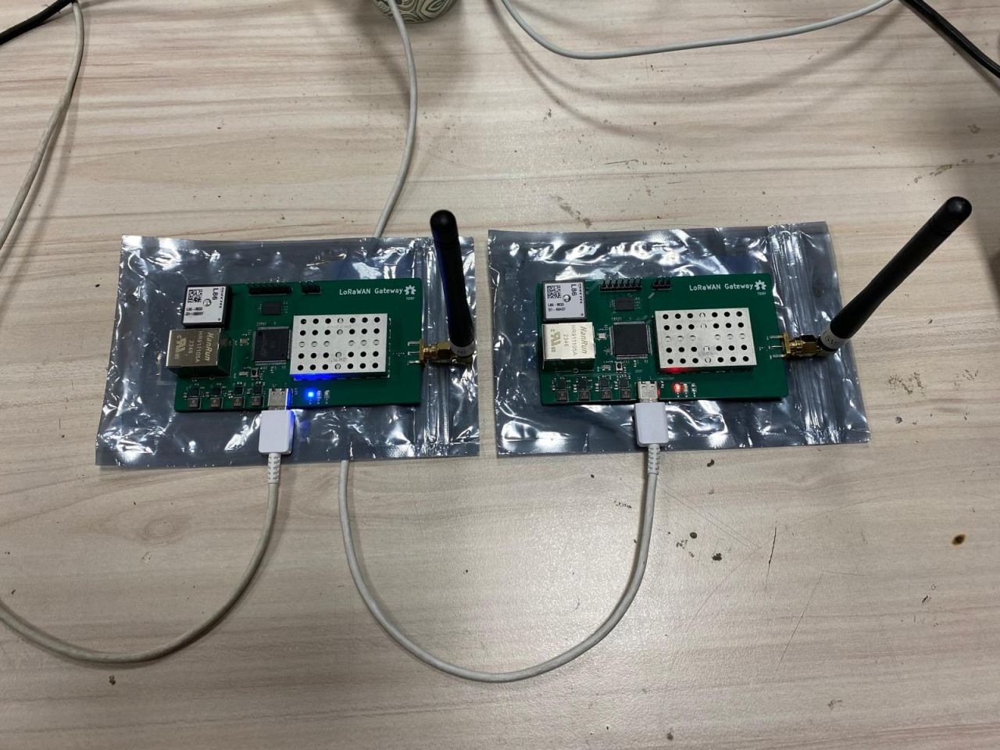
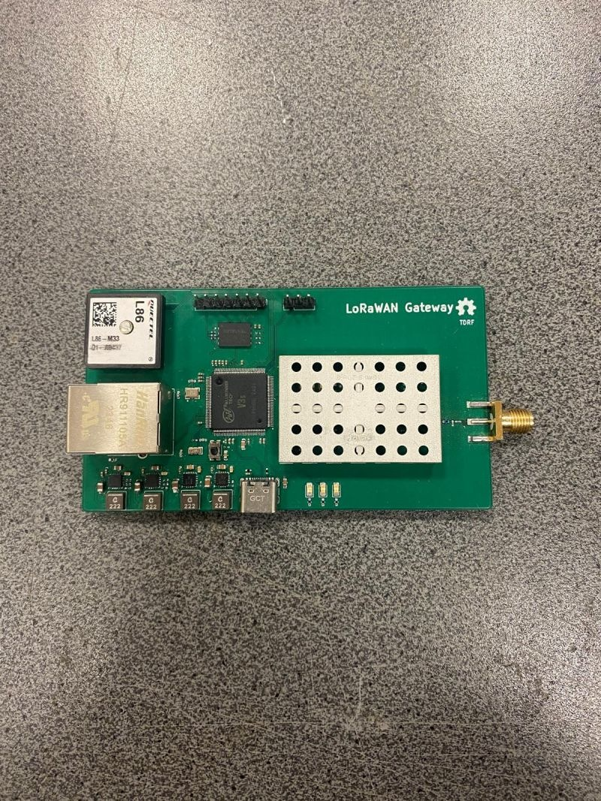
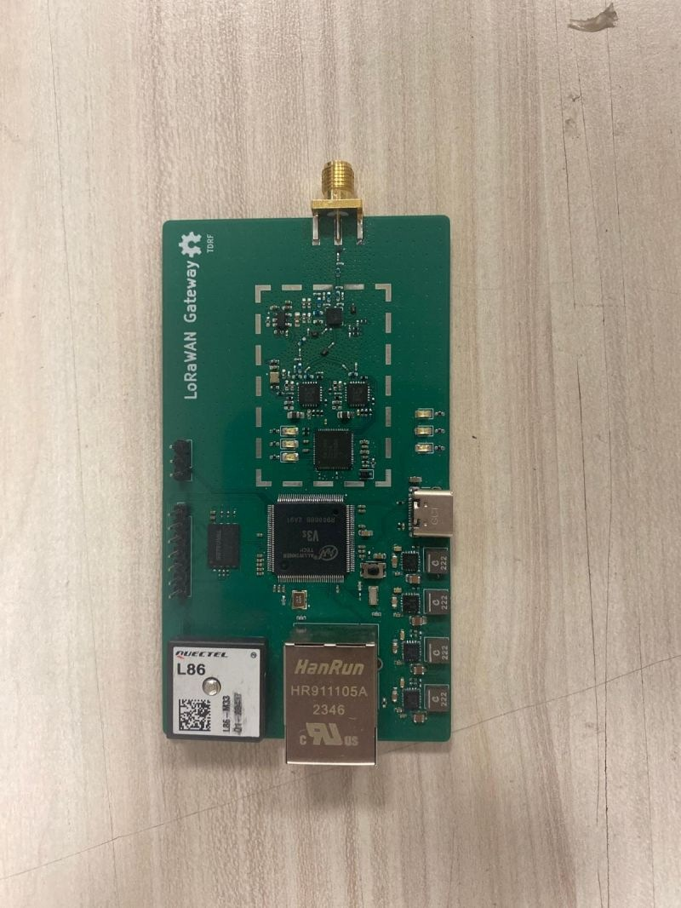

# Open-Source Linux-Based LoRaWAN Gateway

A custom-designed, open-source **LoRaWAN gateway PCB** powered by the **Allwinner V3s ARM Cortex-A7 processor** and the **Semtech SX1302 LoRa concentrator**.

The gateway combines custom hardware with an embedded Linux software stack built using Buildroot, providing a flexible platform for LoRaWAN communication and IoT applications.

## Hardware Prototypes



Two assembled and tested LoRaWAN gateway prototypes.

| Assembled Gateway | PCB Component Layout |
|---|---|
|  |  |

## Project Overview

This project focuses on designing and developing a standalone Linux-based LoRaWAN gateway, including both custom PCB hardware and embedded Linux firmware.

The gateway was developed under the **TÜBİTAK 2209-A Undergraduate Research Projects Support Program** and subsequently integrated into the **LoRa-Based Low-Power Tracking System for Critical Cargo**, supported by the **TUSAŞ LIFT UP Graduation Project Support Program**.

## Hardware

The hardware was designed in **KiCad**, integrating the processing unit, LoRa concentrator, RF transceivers, and peripheral interfaces on a custom PCB.

### Main Components

| Component | Description |
|---|---|
| Allwinner V3s | ARM Cortex-A7 MPU with integrated 64 MB DDR2 RAM |
| Semtech SX1302 | LoRa Core digital baseband concentrator |
| Semtech SX1250 | LoRa RF transceivers |
| Ethernet | Wired network connectivity |
| Quectel L86 | GNSS module |
| USB Type-C | USB interface |
| Custom PCB | Integrated gateway hardware platform |

## Embedded Linux Software

The gateway runs a customized embedded Linux distribution generated using **Buildroot**.

The software environment includes:

- **Linux Kernel:** Customized for the Allwinner V3s hardware platform
- **Buildroot:** Embedded Linux build system
- **BusyBox:** Lightweight userspace utilities
- **Semtech UDP Packet Forwarder:** Forwarding LoRa packets to a network server
- **ChirpStack:** LoRaWAN Network Server integration

### System Architecture

```text
        LoRaWAN End Devices
                 |
                 | LoRa RF
                 v
       +-------------------+
       | Semtech SX1250    |
       | RF Transceivers   |
       +---------+---------+
                 |
                 v
       +-------------------+
       | Semtech SX1302    |
       | LoRa Concentrator |
       +---------+---------+
                 |
                 | SPI
                 v
       +-------------------+
       | Allwinner V3s     |
       | Embedded Linux    |
       | Buildroot         |
       | Packet Forwarder  |
       +---------+---------+
                 |
                 | Ethernet
                 v
       +-------------------+
       | ChirpStack        |
       | LoRaWAN Network   |
       | Server            |
       +-------------------+
```

## Testing and Validation

Two final hardware prototypes were manufactured, assembled, and tested.

The gateway was integrated into a LoRa-based low-power tracking system for critical cargo, providing a practical environment for evaluating the custom hardware and embedded Linux software.

## Repository Contents

This repository focuses on the **hardware design** of the LoRaWAN gateway.

It contains the KiCad project and associated hardware design resources, including:

- PCB schematic
- PCB layout
- Component symbols and footprints
- Manufacturing and production files

## Project Team

- **Tunahan Kaya** — Embedded Linux and software development
- **Dilara Tatar** — Hardware development
- **Dr. Yalçın Albayrak** — Academic advisor

## Acknowledgments

This project was supported by the **TÜBİTAK 2209-A Undergraduate Research Projects Support Program**.

The gateway was also integrated and tested within a project supported by the **TUSAŞ LIFT UP Graduation Project Support Program**.

Special thanks to the project team and our academic advisor for their contributions and support throughout the development process.

## References

- [GitHub Repository](https://github.com/Rynxie/tdrf-lorawan-gateway-pcb)
- [Original LinkedIn Post](https://lnkd.in/p/d-5i6TTB)
